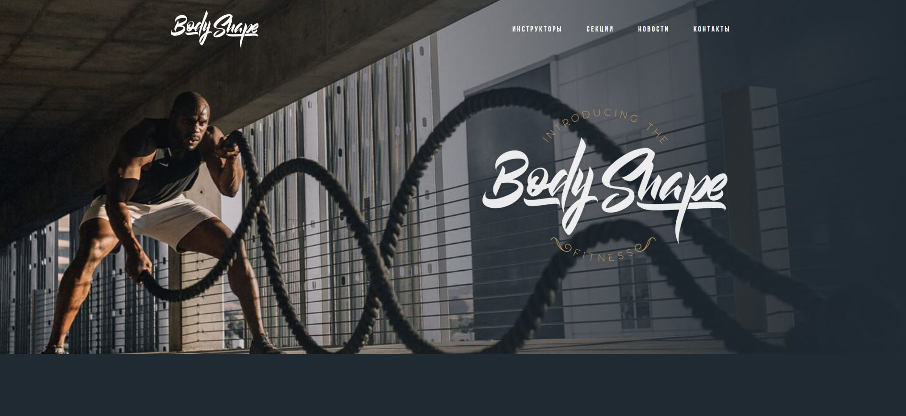

# Проект "BodyShape"
## Описание

Проект "BodyShape" представляет собой адаптивную веб-страницу. Этот проект разработан с использованием HTML, CSS, адаптивная и семантическая верстка + использование CSS переменных + использование относительных единиц измерения и многое другое. По БЭМ.

## Технологии

- **HTML**: Структура веб-страницы
- **CSS**: Стилизация и оформление

## Функциональность

- Адаптивный дизайн для различных устройств

# Ссылка на сам проект 

(https://aaronio777.github.io/bodyShape-project/)
